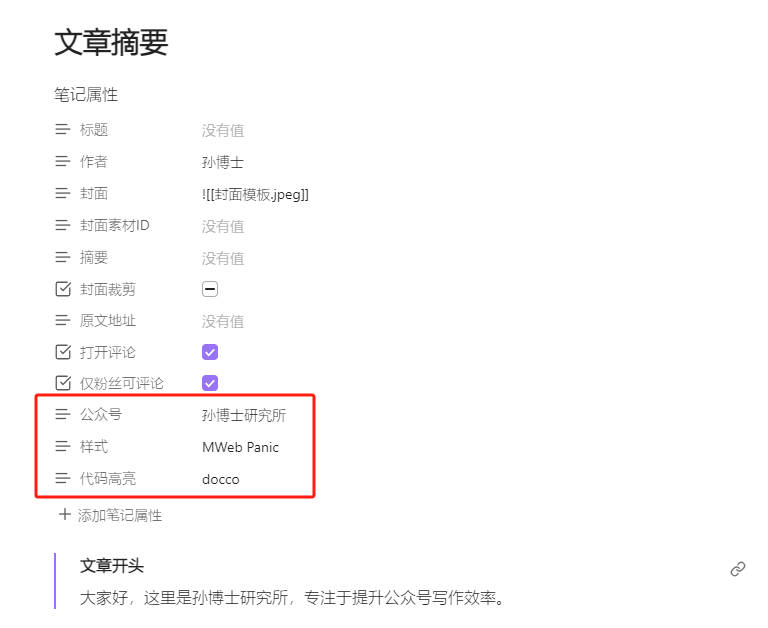

## 2.1.1

* 修复Bug
* 优化数学公式

### 数学公式优化
在之前版本中，数学公式默认会缩小一号，现在默认不缩小。

如果需要缩小，可以通过如下自定义CSS进行调整。

````
``` less
.note-to-mp {
	.block-math-svg {
		svg {
			font-size: 0.85em;
		}
	}

	.inline-math-svg {
		svg {
			font-size: 0.85em;
		}
	}
}
```
````

如果文章中公式较多，可以尝试修改段落的行高来调整公式显示效果。

````
``` less
.note-to-mp {
	p {
		line-height: 1.8em;
	}
}
```
````

## 2.1.0

本次更新重点增强了内容创作与自动化能力，让发布流程更高效、更智能。

* 支持 𝕏（推特）文章发布（会员功能）
* 新增工作流支持，打通自动化创作
* 超宽表格显示优化
* 更简单的定制您自己的文章样式
* 支持使用LESS定义文章样式
* 修复若干已知问题，优化使用体验

### 支持 𝕏（推特）文章
> [!WARNING]
> 目前该功能还无法完全支持 𝕏 文章编辑器，在某些情况下存在格式丢失的风险!
> 请谨慎使用！

现在可以将Obsidian笔记发布为 𝕏（推特）长文章。

**使用前提：**
需配合「[文兔兔助手(v0.0.4)](https://chromewebstore.google.com/detail/cefclimhdhgbknphcabhpnmmcnpjlajg)」浏览器插件使用。

**使用方法：**
在插件中复制内容后，在chrome中打开 𝕏 文章编缉页面，通过文兔兔助手的**同步到 𝕏（推特）文章**功能，将笔记同步到 𝕏 文章编辑器中。

**目前支持的内容格式：**

* 标题
* 副标题
* 正文
* 图片
* 引用
* 列表

**暂不支持：**

* 代码块
* 分割线
* 数学公式

> [!WARNING]
> 如果笔记中包含图片，可能出现部分内容格式丢失的情况。
> 
> 另外，图片上传耗时较长，请耐心等待图片上传完成。


### 工作流支持（自动化创作升级）

如果你正在使用 n8n、Coze 等工作流平台，现在可以直接与 NoteToMP 打通，实现：

* AI 自动生成内容
* 发布前 / 发布后自动执行额外动作
* 通过『**NoteToMP:运行工作流**』命令手动触发工作流

#### 安全获取公众号 AccessToken（会员功能）

在工作流中调用公众号 API 时，通常需要暴露 AppSecret，存在安全风险。

现在插件提供专用接口来获取 AccessToken：

* 不需要在工作流中暴露 AppSecret
* 不需要固定服务器 IP
* 更安全、更简单

详细教程：[如何使用AI工作流为公众号创作赋能？](https://mp.weixin.qq.com/s/M2aL0l-NOn15T7YoAO413A)


#### 在笔记中直接触发工作流

你可以在笔记里插入一个 `workflow` 代码块，在发布前或发布后自动调用外部工作流。

示例：

````markdown
```workflow
url: https://api.coze.cn/v1/workflow/stream_run
runAt: start
method: POST
header:
  authorization: Bearer pat_12345
  content-type: application/json
body:
  workflow_id: "123456789"
  enabled: true
  parameters: 
    title: $title
```
````


#### 调用参数说明

* `url`：请求地址
* `runAt`：执行时机
  * `start`：发布前执行
  * `end`：发布后执行
* `method`：GET 或 POST
* `header`：请求头
* `body`：请求体


#### 支持动态引用笔记内容、笔记属性等

工作流参数支持直接引用当前笔记属性或仓库内容：

```yaml
body:
  workflow_id: "123456789"
  enabled: true
  parameters: 
    author: $author
    content: ![[提示词]]
    image: ![[cover.jpg]]
```

说明：

* `$author` → 当前笔记的 author 属性
* `[[提示词]]` → 引用名为“提示词”的笔记内容
* `![[cover.jpg]]` → 引用仓库中的图片文件

通过该功能可以将仓库中的笔记、图片等内容，作为参数传递给工作流，实现更灵活的自动化创作。

### 超宽表格显示优化
新版本中超宽表格会显示滚动条，用户可以滚动查看表格内容。

**⚠️注意：**

由于Markdown中无法设置表格中单元格的宽度，正常情况下表格会被压缩，导致单元格宽度很小，用户体验不佳。

可以通过在表头中增加`&nbsp;`的个数来设置单元格的最小宽度。

示例：

````markdown
| 表头1&nbsp;&nbsp;&nbsp;&nbsp;&nbsp;&nbsp; | 表头2&nbsp;&nbsp;&nbsp;&nbsp;&nbsp;&nbsp; |
| --- | --- |
| 内容1 | 内容2 |
````


### 自定义文章样式
新版本支持使用`less`定义文章样式，并且新增了`自定义`主题，启用`自定义`主题后，将完全使用用户自定义的样式，不再受默认样式影响，用户可以完全控制文章的样式。

详细的使用指南请参考：[自定义文章样式](https://docs.dualhue.cn/customcss)


## 2.0.0
- 新增支持知乎、头条、小红书等平台
- 新增多篇笔记合并发布为一篇
- 新增自选笔记批量发布、合并发布
- 新增文档属性`自定义样式笔记`支持单独设置自定义CSS
- 修复偶发会员功能失效的bug
- 修复部分携带路径插入的图片无法渲染的bug
- 优化空行渲染
- 废弃custom.css，请使用仓库中的笔记保存CSS

空行的最终显示高度会受到当前主题的影响。如果你对高度不太满意，可以通过自定义 CSS 进行微调，修改`line-height`、`margin-top`、`margin-bottom`的值来调整高度。
**注意`margin-top`、`margin-bottom`的值应该是负值。**

```
.note-to-mp p.note-empty-line {
  line-height: 1.2em;
  margin-top: -0.75em;
  margin-bottom: -0.45em;
}
```

## 1.3.2
Bug fix.

## 1.3.1
### 问题修复
- 公式渲染异常
- 脚注无法正常渲染重复引用
### 公式展示优化
之前版本的数学公式文字比正文文字偏大，现通过如下CSS缩小一号：
```
/* 行间公式 */
.block-math-svg svg {
  scale: 0.85;
}
/* 行内公式 */
.inline-math-svg svg {
  font-size: 0.85em;
}
```
如有需要可通过自定义CSS自己调整。

### 脚注优化
脚注统一增加了`class="fnref-sup"`，可以通过如下自定义CSS为脚注增加[]
```
.fnref-sup::before {
	content: '['
}
.fnref-sup::after {
	content: ']'
}
```

## 1.3.0
更新内容：

- 主题优化
  - 修复代码块、列表在微信公众号后台展示异常的问题
  - 去掉样式的padding，有背景颜色的样式保留了padding
  - 优化代码块样式，改为由代码主题控制
  - 主题支持::before、::after伪元素
- 支持脚注，使用脚注时请在插件设置中将链接展示样式改为内嵌
- 新增保留笔记中的空行，通过插件设置——启用空行渲染开关启用
- 新增标注自定义，支持使用新的svg图标，并且可以通过`section .note-callout-custom`定义标注颜色
- 新增去公众号后台按钮（仅在桌面端展示），点击后会在系统浏览器打开公众号后台
- 新增专家设置
  - 支持标题自定义渲染，标题、标注、代码直接转换为小部件
  - 支持发布配置文档属性重映射，用户可自行适配自己的笔记体系，简化文章发布配置
- 数学公式改为不缩放，避免在手机端变小
- 新增单篇快速发布、文件夹批量发布（会员功能）
- 新增发布命令`NoteToMP:发布公众号文章`，命令ID：`note-to-mp-pub`，真正实现一键发布
- 简化会员操作
  - 可自行更改绑定公众号，半年、年度会员可绑定5个公众号，永久会员20个公众号，其他可绑定1个
  - 会员购买自助下单，即买即用，无需再提供公众号AppID，会员购买请用微信扫描下方小程序码（详细购买步骤：[NoteToMP会员购买操作步骤](https://dual-hue.feishu.cn/docx/YF9JdmjCPow27ixpAbhc49WfnMh)）


## 1.2.1
更新内容如下：

- 修复Mermaid渲染失败的问题；
- 修复Excalidraw渲染失败的问题；
- 修复嵌入笔记会渲染笔记属性的问题；
- 新增Excalidraw可渲染为PNG或者SVG；

## 1.2.0
NoteToMP 1.2.0版本发布了，新功能如下：

- 使用仓库内笔记作为自定义CSS
- 支持Obisidian注释
- 支持话题
- 会员功能：导出HTML
- 会员功能：支持永久会员

## 1.1.3
Bug fix.

## 1.1.2
新增如下功能：

- 图片消息
- 水印
- 图片标题
- webp图片上传

## 1.1.1
- 支持WebP图片上传（需要重新下载主题资源）
- 修复部分图床图片无法上传的问题
- 修复手机端无法上传图片的问题
- 修复标题上传后增加多余空白的问题

## 1.1.0
- 支持图床图片上传到微信公众号
- 在文档属性中加入：`公众号`、`样式`、`代码高亮`配置方便多公众号区分风格
文档属性示例：
```
---
标题: 
作者: 孙博士
封面: "![[封面模板.jpeg]]"
封面素材ID: 
摘要: 
封面裁剪: 
原文地址: 
打开评论: true
仅粉丝可评论: true
公众号: 孙博士研究所
样式: MWeb Panic
代码高亮: docco
---
```


- 新增样式小部件，可以快速使用特定样式，比如各种标题、苹果风格代码块，文章推荐、双列图片等，详细使用指南

## 1.0.10
- 修复Bug
- 增加轻量自定义样式
- 支持SVG文件嵌入
- 嵌入文件样式默认改为正文

## 1.0.9
bug 修复

## 1.0.8
- 支持摘要、封面裁剪
- 支持SVG图标渲染
- 优化文件嵌入渲染

## 1.0.7
- 支持数学公式（支持LaTeX和AsciiMath两种语法）
- 支持自定义css
- 支持插入公众号卡片
- 支持背景高亮
- 支持嵌入文件渲染（目前只支持一级深度）
- 图片支持设置大小

## 1.0.6
- 调整AppSecret存储策略，取消服务端存储，采用本地加密存储；
- 支持多公众号切换；
- 优化移动端UI；

## 1.0.5
- 支持Callouts；
- 调整样式；
- 支持本地图片上传；

## 1.0.4
update readme.

## 1.0.3
优化样式;

## 1.0.2
拆分主题文件，新增链接展示样式等;

## 1.0.1
Update readme.

## 1.0.0
First release.