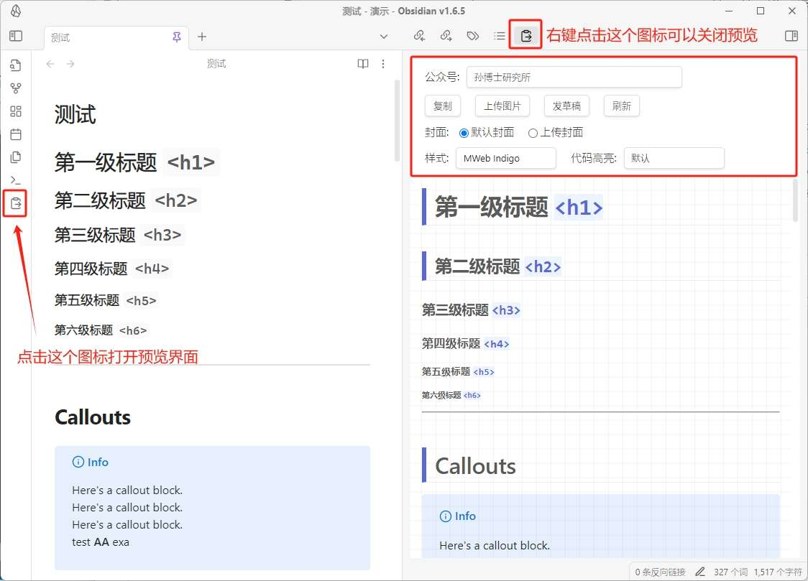
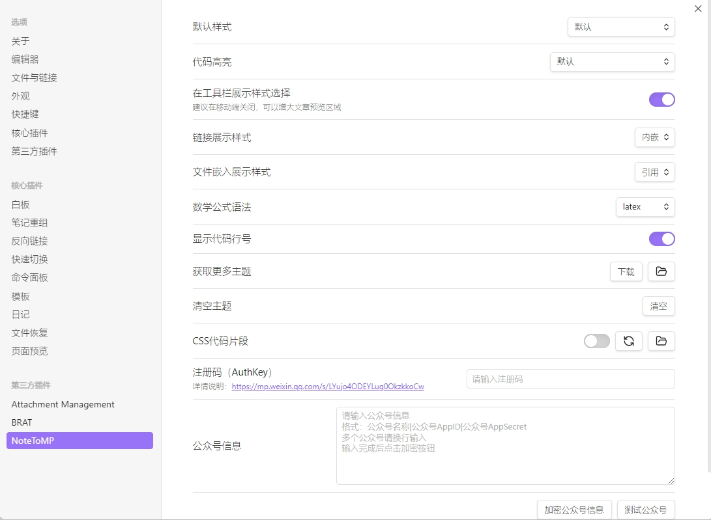

## 1、简介

这是一个Obsidian插件，针对微信公众号编缉器进行了优化，通过本插件复制笔记可以把笔记样式同步到公众号编缉器，轻轻松松搞定文章格式，一劳永逸，而且支持代码高亮、代码行数显示、主题背景颜色等。针对微信公众号不能放链接也专门处理了，提供直接展示链接地址和文末脚注展示两种方式。本项目初衷仅是为了能够将Obsidian中笔记的样式完美同步到微信公众号的编辑器中，因此项目重点在于保证文章格式的一致性，而不是成为一个微信公众号编辑器。


## 2、安装
首先，**请确认已关闭了Obsidian的安全模式**。如未关闭，请通过**设置——第三方插件——关闭安全模式**关闭。
### 2.1 插件安装

#### 1）从官方**社区插件市场**安装
通过Obsidian**设置——第三方插件——社区插件市场**，输入**NoteToMP**搜索安装。

#### 2）从网盘下载安装
| 网盘    | 下载地址                                                     |
| ----- | -------------------------------------------------------- |
| 夸克网盘  | https://pan.quark.cn/s/59580a6d1ec8                      |
| 123云盘 | https://www.123pan.com/s/3kWOTd-Ao1e                     |
| 百度网盘  | https://pan.baidu.com/s/1ij_rpXHqP-Am8uomFunNnQ?pwd=qy89 |

下载其中的**note-to-mp-xxxx.zip**，解压后，将其中的**note-to-mp**目录拖到`.obsidian/plugins`目录下。

打开Obsidian的**设置**界面，点击**第三方插件**，在**已安装插件**中刷新一下，然后启用本插件**Note To MP**。
#### 3）从Github下载安装
到[Release](https://github.com/sunbooshi/note-to-mp/releases)页面下载最新版本，将`main.js`、 `manifest.json`、`styles.css`保存到Obsidian仓库的`.obsidian/plugins/note-to-mp`目录下。

打开Obsidian的**设置**界面，点击**第三方插件**，在**已安装插件**中刷新一下，然后启用本插件**Note To MP**。

### 2.2 主题资源安装
如果采用的是用从插件市场或者Github下载安装的方式，在插件安装完成后还需要再下载主题资源。网盘里的安装包已经集成了主题样式，无需下载。

**1）通过设置下载**
为了尽可能保证插件符合官方规范，主题和代码高亮需要打开Obsidian的**设置**界面，在底部的**第三方插件**——**Note to MP**——**获取更多主题**手动下载。

**2）手动下载**
也可以直接在[Release](https://github.com/sunbooshi/note-to-mp/releases)页面下载`assets.zip`文件，解压后放到`.obsidian/plugins/note-to-mp/assets`目录下。

### 2.3 常见安装问题

==⚠️插件的目录名必须是：== `note-to-mp`，出现安装问题是请先检查目录名是否正确。

**1）插件无法启动**
检查一下你安装的插件路径是否正确，插件目录名及目录内容应如下所示：
```
.obsidian/plugins/note-to-mp/
├── main.js
├── manifest.json
└── styles.css
```

**2）只有默认主题**
确认根据**2.2 主题资源安装**里的步骤操作了，然后检查一下插件目录内容，应如下所示： 
```
.obsidian/plugins/note-to-mp/
├── assets
│   ├── themes.json
│   ├── highlights.json
│   ├── themes
│   │   ├── maple.css
│   │   ├── mweb-ayu.css
│   │   └── ...
│   └── highlights
│       ├── a11y-dark.css
│       ├── a11y-light.css
│       └── ...
├── main.js
├── manifest.json
└── styles.css
```

## 3、使用
点击Obsidian左侧工具栏中的图标
或者按`Ctrl+P`打开命令，搜索**复制到公众号**。

检查样式无误后，点击**复制**按钮，然后到公众号粘贴即可。



**★ 公众号**
插件支持多公众号，在下拉菜单中进行不同公众号的切换。该功能需要订阅才能使用。

**★ 复制**
检查样式无误后，点击**复制**按钮，然后到公众号编辑器粘贴即可。

**★ 上传图片**
点击上传图片会将文章中的本地图片上传到微信公众号，同时会替换预览中的图片地址，而您原始文章中的图片地址不会替换。上传图片完成之后，此时点击“复制”，然后到微信公众号编缉器中粘贴就可以把图片带过去了。该功能需要订阅才能使用。

**★ 发草稿**
点击发草稿会上传文章中的本地图片，并且将文章发送到公众号的草稿箱，省去粘贴步骤。在文章正式发布之前还有一些选项需要您设置，比如文章摘要等。考虑到安全性，插件暂不提供直接发布功能。该功能需要订阅才能使用。

**★ 刷新**
如果笔记内容更新了，但是预览没有更新，可以点击一下刷新按钮。

**★ 封面**
发草稿必须设置文章封面，使用默认封面，是从您的永久素材中选取最近使用的作为封面，您需要在发布文章之前重新设置一下。本地上传则需要你选取一张本地图片作为封面。

**★ 样式**
可以选取笔记的样式，目前有30多款，还在持续增加中。如果有钟意的样式，可以在插件设置中，设置为默认样式，这样就不用每次都点一下了。

**★ 代码高亮**
设置代码高亮的样式。


## 4、插件设置


插件设置主要新增了一下设置：
- 在工具栏展示样式选择
- 文件嵌入展示样式
- 数学公式语法
- CSS代码片段
- 在获取更多主题中增加了打开主题目录按钮

其中各项设置详细说明如下：

**1、 在工具栏展示样式选择**

关闭该选项后，在预览界面不会展示样式选取和代码高亮选取了，可以增加预览显示范围，在手机端推荐关闭，但是1.0.7版本在手机端适配有问题无法加载插件，下一版本会解决。

**2、 文件嵌入展示样式**

有两种样式引用和正文，引用为Obsidian默认渲染样式，正文是直接讲嵌入内容渲染成正文内容。

**3、 数学公式语法**

可以在LaTeX和AsciiMath中切换。

**4、 CSS代码片段**

启用后可以在插件中使用自定义CSS文件。点击目录按钮，可以打开CSS代码片段所在目录，在该目录中创建`custom.css`文件，然后在该文件中输入需要自定义的CSS样式。刷新按钮可以让插件重新读取CSS样式。详细使用指南见后文。

**5、 在获取更多主题中增加了打开主题目录按钮**

方便大家更容易找到主题保存目录

### 数学公式使用指南

- [LaTeX使用指南：从入门到精通 - 少数派](https://sspai.com/post/77684)
- [通用 LaTeX 数学公式语法手册 - UinIO.com 电子技术实验室](http://www.uinio.com/Math/LaTex/)
- [AsciiMath Parser 🚀 Asciimath Parser](https://asciimath.widcard.win/zh/introduction/)
- [AsciiMath](https://asciimath.org/)

目前插件支持LaTeX和AsciiMath两种数学公式语法，对于公式输入不是特别频繁，而且不怎么熟悉LaTeX的用户来说可以尝试使用AsciiMath，AsciiMath相对简单一些，可以现学现用，直接在官网查找手册编写就可以了。因为在正常的Markdown语法中无法区分采用的是哪种数学公式语法，所以需要在插件中设置默认的数学公式语法，默认是LaTeX语法。对于有混写需求的朋友来说，可以采用代码块的语法来写数学公式，然后指定latex或者asciimath来明确当前语法。但使用代码块语法的时候在Obsidian中并不能实时预览公式。

如果需要使用AsciiMath，还需要安装asciimath插件才能在Obsidian中实时预览，不过asciimath插件的解析器和官方的语法有一些差异，主要体现在矩阵写法上，所以使用时也需注意。另外需要特别提醒的是AsciiMath不支持在一个语法块中写多行公式，所以如果要写多行公式，只能每行公式单独写一个语法块。LaTeX是支持多行公式的。

数学公式的专业性很强，我也无法全面测试，如果遇到无法正常渲染的情况，欢迎反馈。

````markdown
行内公式：$c=\pm\sqrt{a^2+b^2}$
行间公式：
$$
c=\pm\sqrt{a^2+b^2}
$$

使用代码块方式可以指定公式语法，该方法仅适用行间公式。

采用latex语法的数学公式：
``` latex
c=\pm\sqrt{a^2+b^2}
```

采用asciimath的数学公式：
``` am
c=+-sqrt(a^2+b^2)
```
````

数学公式的渲染效果可以看这篇文章：[公众号文章里的数学公式排版秘籍](https://mp.weixin.qq.com/s/-kpT2U1gT_5W3TsDCAVgsw)👈️
### 自定义CSS使用指南

首先需要在插件的设置中启用自定义CSS，然后点击文件夹图标按钮，在打开的目录中新建一个`custom.css`文件，在`custom.css`输入你需要定义的样式CSS代码就可以了。文件保存后，点击刷新按钮就可以在插件预览中查看自定义的效果了。

关于自定义CSS的写法可以参考下面的代码
```css
/* 全局属性  
 * 这里可以设置字体，字体大小，边距，背景颜色等
 */  
.note-to-mp {  
    /* 注：请在大括号内改写！！！ */  
}  

/* 段落 */  
.note-to-mp p {  
    /* 注：请在大括号内改写！！！ */  
}  

/* 一级标题 */  
.note-to-mp h1 {  
    /* 注：请在大括号内改写！！！ */  
}

/* 一级标题内容 */  
h1 .h-content {  
    /* 注：请在大括号内改写！！！ */  
}

/* 一级标题前缀 */  
h1 .h-prefix {  
    /* 注：请在大括号内改写！！！ */  
}

/* 一级标题后缀 */  
h1 .h-suffix {  
    /* 注：请在大括号内改写！！！ */  
}

/* 二级标题 */  
.note-to-mp h2 {  
    /* 注：请在大括号内改写！！！ */  
}

/* 二级标题内容 */  
h2 .h-content {  
    /* 注：请在大括号内改写！！！ */  
}

/* 二级标题前缀 */  
h2 .h-prefix {  
    /* 注：请在大括号内改写！！！ */  
}

/* 二级标题后缀 */  
h2 .h-suffix {  
    /* 注：请在大括号内改写！！！ */  
}

/* 三级标题 */  
.note-to-mp h3 {  
    /* 注：请在大括号内改写！！！ */  
}

/* 三级标题内容 */  
h3 .h-content {  
    /* 注：请在大括号内改写！！！ */  
}  

/* 三级标题前缀 */  
h3 .h-prefix {  
    /* 注：请在大括号内改写！！！ */  
}  
  
/* 三级标题后缀 */  
h3 .h-suffix {  
    /* 注：请在大括号内改写！！！ */  
}  
  
/* 无序列表整体样式  
 * list-style-type: square|circle|disc;  
 */  
.note-to-mp ul {  
    /* 注：请在大括号内改写！！！ */  
} 

/* 加粗 */  
.note-to-mp strong {  
    /* 注：请在大括号内改写！！！ */  
}  
  
/* 斜体 */  
.note-to-mp em {  
    /* 注：请在大括号内改写！！！ */  
}  
  
/* 加粗斜体 */  
.note-to-mp em strong {  
    /* 注：请在大括号内改写！！！ */  
}  
  
/* 删除线 */  
.note-to-mp del {  
    /* 注：请在大括号内改写！！！ */  
}  
  
/* 分隔线  
 */  
.note-to-mp hr {  
    /* 注：请在大括号内改写！！！ */  
}
/* 图片
 */  
.note-to-mp img {  
    /* 注：请在大括号内改写！！！ */  
}
/* 
 * 文件嵌入引用
 */
.note-embed-file {
	/* 注：请在大括号内改写！！！ */  
}
/* 
 * 高亮颜色
 */
.note-highlight {
  /* background-color: rgba(255,208,0, 0.4); */
}

/* 
 * Callout
 * 可以调整各种类型Callout的文字颜色和背景颜色
 * color: rgb(158, 158, 158);
 * background-color: rgba(158, 158, 158, 0.1);
 */
.note-callout-note { 
}
/* abstract tip hint */
.note-callout-abstract {
}
.note-callout-success {
}
/* question  help, faq, warning, caution, attention */
.note-callout-question {
}
/* failure, fail, missing, danger, error, bug */
.note-callout-failure {
}
.note-callout-example {
}
.note-callout-quote {
}
```

例如这篇文章[几个让公众号排版更精致的小技巧，手机上也可以！](https://mp.weixin.qq.com/s/Q4_pV9TW8un3qZ0vrUvD1A)👈️使用的自定义样式如下：
```css
.note-to-mp {
    font-family: Optima-regular, Optima, "Microsoft YaHei", PingFangSC-regular, serif;
}

h2 strong {
    display: inline-block;
    background: rgb(90, 185, 131);
    color: rgb(255, 255, 255);
    padding: 2px 16px;
    border-top-right-radius: 3px;
    border-top-left-radius: 3px;
    margin-right: 10px;
    visibility: visible;
}

h2 {
  border-bottom: rgb(90, 185, 131) 2px solid;
  color: rgb(90, 185, 131);
}

section .note-callout-example {
    color: rgb(90, 185, 131);
    background-color: rgba(90, 185, 131, 0.1);
}
```
上面的例子，通过`.note-to-mp`指定了文章的字体，通过`h2 strong`单独定义了h2标题下strong的样式，这样可以在标题中通过使用粗体增加了一个边框样式。通过`h2`定义了h2标题的底部线条的宽度和文本颜色。这样配合**Olive Dunk**主题就形成了自己的风格。
### 公众号卡片

公众号卡片内容需要从已发布并且包含公众号卡片的文章中获取，然后在公众号中回复卡片，会获得一个链接，点击链接，在其中输入包含公众号卡片的文章链接，点击获取即可获得公众号卡片代码，点击复制将内容粘贴到Obsidian中，插件就可以在文章中插入公众号卡片了。详细的操作视频如下：

<iframe src="https://player.bilibili.com/player.html?isOutside=true&aid=113006126107328&bvid=BV1rPW7eqEUH&cid=500001658617131&p=1&autoplay=0" width="640" height="360" scrolling="no" border="0" frameborder="no" framespacing="0" allowfullscreen="true"></iframe>


### 设置图片大小

在Obsidian中可以设置图片的大小，语法如下：

```markdown
![[1.jpg|120x80]] 设置图片的宽度和高度
![[1.jpg|120]] 设置图片的宽度，高度按比例缩放
```

NoteToMP插件支持该语法。

### 文件嵌入

文件嵌入是Obsidian一个很有用的功能，可以直接展示其它文件中的段落、章节。在写公众号的时候可以将以前文章的内容引用展示，也可以将该功能当作模板使用。

文件嵌入的语法如下：

```markdown
![[文件名称#章节标题]]
![[文件名称#^段落标记]]
```

在NoteToMP插件中有两种展示文件嵌入内容的样式，一种是引用，也就是Obsidian默认的方式，一种是正文，相当于模板的方式。与模板不同的是，采用嵌入方式内容会跟随被嵌入文件的内容更改。

### 插入SVG图标

<iframe src="https://player.bilibili.com/player.html?isOutside=true&aid=113005807341086&bvid=BV15XWVeEEJa&cid=500001658511185&p=1&autoplay=0"  width="640" height="360" scrolling="no" border="0" frameborder="no" framespacing="0" allowfullscreen="true"></iframe>

### 摘要、封面裁剪、原文链接等
```yaml
---
标题: 
作者: 孙博士
封面: "![[封面模板.jpeg]]"
摘要: 
封面裁剪: 
原文地址: 
打开评论: true
仅粉丝可评论: true
公众号: 孙博士研究所
样式: MWeb Panic
代码高亮: docco
---
```

<iframe src="https://player.bilibili.com/player.html?isOutside=true&aid=113005807338524&bvid=BV15XWVeEEmA&cid=500001658510987&p=1&autoplay=0" width="640" height="360" scrolling="no" border="0" frameborder="no" framespacing="0" allowfullscreen="true"></iframe>

## 5、反馈交流群

**微信群：**
加微信：**Genius35Plus**，备注：**NoteToMP**

