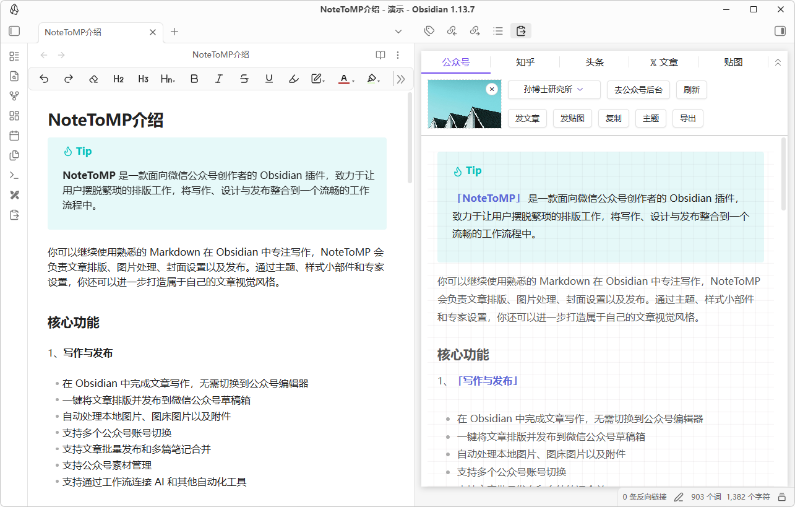
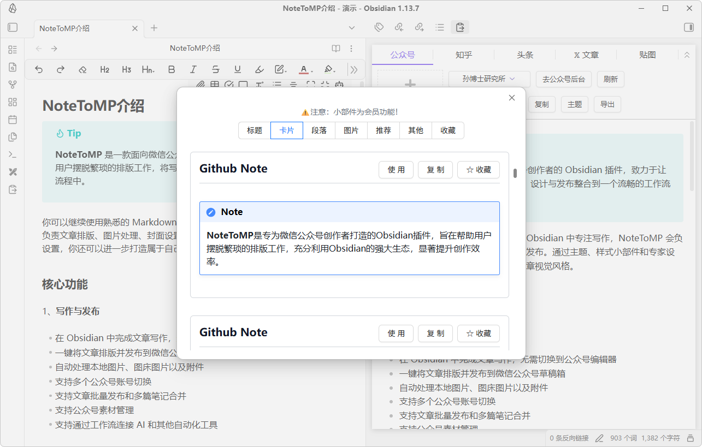
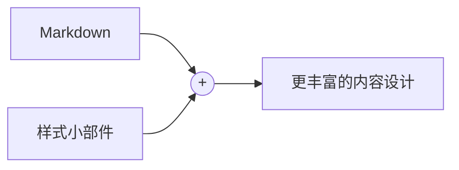
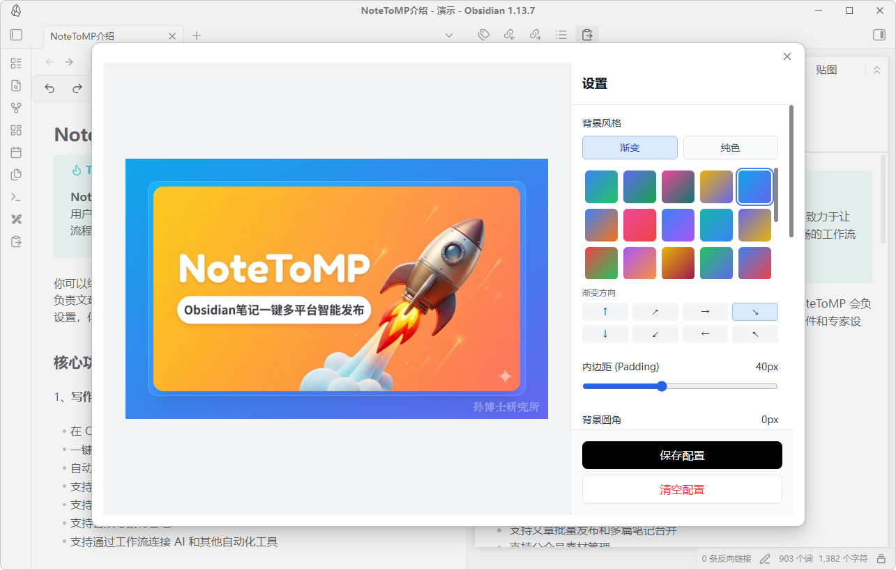
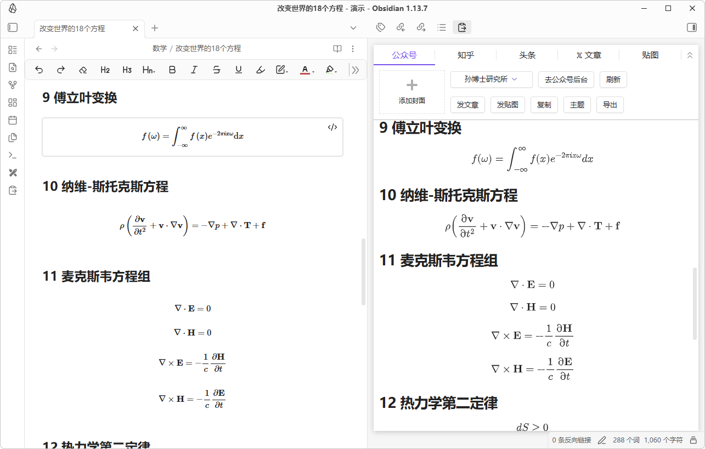
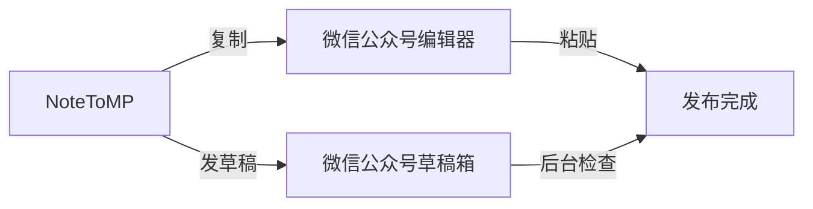
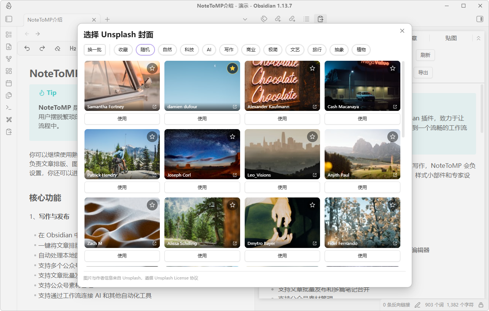
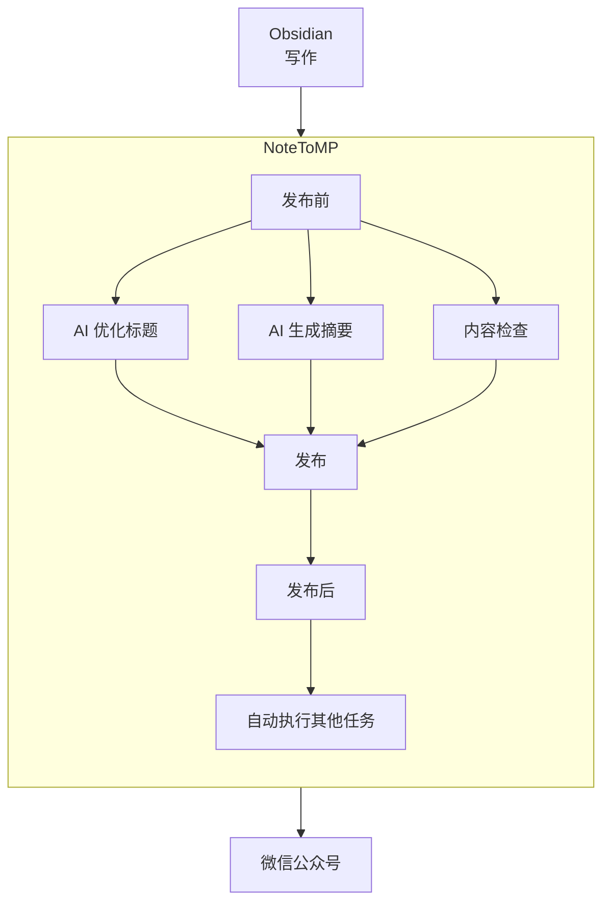

# NoteToMP
> [!TIP]NoteToMP
> **让 Obsidian 成为你的内容创作与发布工作台。**

**写作留在 Obsidian，设计、排版与发布交给 NoteToMP。**

从 Markdown 写作，到主题排版、样式小部件、图片处理，再到微信公众号素材、草稿发布和自动化工作流，一套流程完成内容生产。

**写作 → 设计 → 排版 → 配图 → 发布 → 自动化**

[](https://obsidian.md/)
[](https://github.com/sunbooshi/note-to-mp)
[](https://github.com/sunbooshi/note-to-mp/releases)
[](https://github.com/sunbooshi/note-to-mp)

**[安装](#快速开始) · [核心能力](#核心能力) · [更新日志](./CHANGELOG.md)**

---



## ✨ 为什么选择 NoteToMP？

还在用微信公众号自带的编辑器写文章吗？五分钟写完内容，半小时调格式，调完了还是哪里不对劲。还在为了让文章好看一点，充值会员买那些花里胡哨的排版素材吗？调来调去不仅费时间，还费钱。

**试试 Obsidian + NoteToMP 的组合。**

你在 Obsidian 里正常写 Markdown，该怎么记笔记就怎么写——这份笔记本身就是你的知识库，不是专门为了发公众号才写的一次性内容。写完之后，从 30+ 款精心设计的主题里选一个钟意的，一键排版、一键发草稿，格式、图片、代码高亮、数学公式统统安排妥当。

**效率**上，原来要手动调半小时的格式，现在几秒钟搞定;**素材**上，不需要另外充值购买花哨模板，主题和样式小部件全都内置;**数据**上，你的每一篇文章依然是 Obsidian 仓库里一个普通的 Markdown 文件，存在你自己的电脑里，不依赖任何平台账号，换电脑、换插件都带得走。

> **笔记是你自己的资产，写作和发布本该是同一件事的两个自然结果——而不是两倍的工作量。**

---

# 核心能力

## 1. Obsidian 原生写作

很多"发公众号"的工具，本质上是让你迁就工具的语法——为了排版效果，笔记里塞满了平台专属的标记，离开这个工具，笔记就不完整了。

**NoteToMP 反过来做：笔记怎么写，完全由 Obsidian 原生语法决定，NoteToMP 只负责在发布时把它渲染成一篇完整的公众号文章。** 也就是说，你不需要为了"能发公众号"而改变记笔记的方式，该怎么记就怎么记。

具体来说，NoteToMP 完整支持以下 Obsidian 原生语法，基本覆盖日常写作会用到的所有格式：

* **基础排版**：标题、段落、列表(有序/无序/任务列表)、引用、分隔线、脚注
* **富文本元素**：Callout(提示框)、表格、代码块(带语法高亮)
* **多媒体与嵌入**：图片、GIF、SVG、WikiLink 文件嵌入(引用其他笔记的整篇或某一章节、某一段落)
* **数学公式**：LaTeX、AsciiMath，支持行内公式与行间公式，自动渲染为适配公众号的 SVG(详见[内容处理](#3-内容处理图片--数学公式--文件嵌入))
* **图表与手绘**：Mermaid 流程图、时序图、甘特图等可以直接渲染成图片;Excalidraw 手绘白板笔记也能原样带入文章，不需要额外截图或导出

换句话说，无论你的笔记里有没有一段 Mermaid 流程图、一个 Excalidraw 草图，还是一堆 LaTeX 公式，这篇笔记本身在 Obsidian 里就是可以正常阅读、正常使用的——**它首先是一篇完整的笔记，其次才是一篇待发布的公众号文章。**

---

## 2. 排版设计：主题 · 样式小部件 · 专家设置

### 30+ 排版主题

NoteToMP 提供 **30+ 款排版主题**，可以快速为文章选择完整的视觉风格，统一控制字体、标题、正文、引用、列表、表格、图片、Callout、代码块、背景与间距。选择一个主题，就可以直接开始写作。

如果你有自己的设计风格，也可以使用**自定义主题、CSS 和 LESS(推荐)**完全控制文章样式：

```less
.note-to-mp {
  font-family: Optima， "Microsoft YaHei"， PingFangSC-Regular， serif;
}

.note-to-mp h2 {
  color: #5ab983;
}
```

启用「自定义」主题后，可以完全使用自己的样式，不再受默认主题影响。对于熟悉 CSS / LESS 的用户，NoteToMP 可以作为一个高度可定制的 Markdown → 微信 HTML 渲染工具。也可以通过 [note-to-mp-theme-creator](https://github.com/sunbooshi/note-to-mp-theme-creator) 这个 SKILL 轻松定制自己的文章主题。

### 样式小部件：让 Markdown 拥有"组件"



普通 Markdown 中，同一种标题通常只能拥有统一的样式。但一篇精心设计的公众号文章，往往需要数字标题、特殊标题、提示卡片、推荐文章、图片卡片、内容强调、特殊分隔等更丰富的局部设计——这就是**样式小部件**解决的问题。

样式小部件允许你对文章中的**标题、段落、图片、推荐内容等局部内容使用独立的视觉组件**，每个组件用独立 ID 标识，例如 `#1008`、`#4001`。

**一键插入：** 打开命令面板(`Ctrl/Cmd + P`)→ 搜索「插入样式小部件」→ 选择需要的组件，NoteToMP 会自动插入完整语法，你只需修改内容，不需要记忆复杂语法。

```markdown
> [#1008] 01
```

复杂一点的文章推荐组件：

```markdown
> [#4001] 文章推荐
> > ### 2026-09-06
> > [文章标题](https://example.com)
> > ![[文章封面.jpg]]
```


```mermaid
flowchart LR
    A[Markdown] --> C((+))
    B[样式小部件] --> C
    C --> D[更丰富的内容设计]
```

**Markdown 负责内容，小部件负责局部设计。**

### 专家设置：拒绝侵入式排版

样式小部件语法比较特殊，若直接写在笔记里会影响正常的版式。为此 NoteToMP 提供了**专家设置**——一套基于 YAML 的深度配置能力，不只是"高级 CSS 设置"，而是可以自定义整个渲染过程：

```yaml
render:
  h2: 1038
  code: 5001
  callout:
    note: 6130

frontmatter:
  title: title
  author: author
  cover: cover
```

这样你平时只需要正常写 Obsidian 原生语法(二级标题、Callout、代码块……)，发布时 NoteToMP 会按配置自动转换为指定的小部件。也就是说：

> **你可以继续使用 Obsidian 原生语法写作，而让 NoteToMP 在发布阶段完成复杂的视觉设计。**

专家设置还支持自定义标题 HTML，以及文档属性重映射，可以适配不同用户自己的笔记体系(详见下方[多公众号](#4-发布到微信公众号)一节)。

> ⚠️ 专家设置属于高级功能。如果配置错误可能导致渲染异常，请在充分理解配置规则后再使用。

---

## 3. 内容处理：图片 · 数学公式 · 文件嵌入

### 图片处理与背景

图片往往是 Markdown → 微信公众号过程中最麻烦的一环。NoteToMP 可以处理文章中的本地图片，并在发布过程中完成图片上传和地址处理，支持 Obsidian WikiLink 图片、本地图片、GIF、SVG，以及图片尺寸、背景、圆角、阴影、边框、渐变、水印等效果。

支持 Obsidian 原生图片尺寸语法：

```markdown
![[image.jpg|480]]        # 指定宽度，高度按比例缩放
![[image.jpg|480x360]]    # 同时指定宽度和高度
```

对于需要更精致视觉效果的文章，可以通过 `Ctrl/Cmd + P → 图片背景设置` 为图片增加统一的渐变背景、纯色背景、边框、圆角、阴影、水印，也可以针对某一篇文章临时关闭图片背景。



### 数学公式


NoteToMP 针对微信公众号环境对数学公式进行了专门处理，支持 LaTeX、AsciiMath、行内公式与行间公式，并会将公式转换为适合公众号环境的 SVG。

```latex
$c=\pm\sqrt{a^2+b^2}$      行内公式

$$
c=\pm\sqrt{a^2+b^2}       行间公式
$$
```

也可以通过代码块明确指定公式类型：

````text
```latex
c=\pm\sqrt{a^2+b^2}
```

```am
c=+-sqrt(a^2+b^2)
```
````

### 文件嵌入

Obsidian 的文件嵌入同样可以用于公众号创作，将以前文章中的某一章节、某个段落直接引用到当前文章：

```markdown
![[文件名称#章节标题]]
![[文件名称#^段落标记]]
```

非常适合引用以前的文章、复用知识库内容、制作文章模板、构建系列文章。这意味着：

> **你的 Obsidian 知识库本身，也可以成为公众号内容素材库。**

---

## 4. 发布到微信公众号

### 复制到公众号 / 发送草稿

完成排版后，有两种发布方式：


```mermaid
flowchart LR
    A[NoteToMP] -->|复制| B[微信公众号编辑器] -->|粘贴| C[发布完成]
    A -->|发草稿| D[微信公众号草稿箱] -->|后台检查| C
```

选择「复制」无需重新调整标题、字体、图片和代码样式;选择「发草稿」，NoteToMP 会处理文章中的图片并直接发送到公众号草稿箱，你仍可在正式发布前进入公众号后台做最后检查。

> **NoteToMP 不直接替你发布文章，而是将文章安全地发送到公众号草稿箱。**

### 多公众号与发布配置

如果你同时运营多个公众号，可以在 NoteToMP 中配置多个公众号，并在发布时进行选择。文章的发布配置也可以通过文档属性(frontmatter)保存，把**文章内容 + 发布配置 + 排版配置**一起存在 Markdown 文件里：

```yaml
---
标题:
作者:
封面:
摘要:
封面素材ID:
封面裁剪: false
原文地址:
打开评论: true
仅粉丝可评论: false
公众号:
样式:
自定义样式笔记:
禁用图片背景: false
---
```

如果你的笔记体系使用不同的属性名称，可以通过专家设置中的**文档属性重映射**进行适配。

### 素材管理与封面

- **素材管理**：2.4.0 起支持公众号素材管理，通过命令面板「公众号内容管理」进入，可以把文章、图片、封面等内容逐渐纳入统一的内容生产流程，让 NoteToMP 成为 **Obsidian 与微信公众号内容资产之间的连接层**。
- **Unsplash 封面**：2.4.0 起支持发布时直接使用 Unsplash 图片作为文章封面，不需要每次单独寻找和下载封面图。


---

## 5. 多平台内容分发与笔记转图片

### 笔记转图片

除了公众号文章，NoteToMP(2.3.0 起)还可以直接将 Obsidian 笔记转换成图片，适用于公众号贴图、小红书图片、知识卡片、教程长图、社交媒体内容等场景。可设置图片尺寸、字体、边距、背景，导出图片或直接发布为公众号贴图。

### 多平台分发

一篇 Obsidian 笔记可以进一步用于其他内容平台。目前已支持或提供相关发布能力：微信公众号、微信公众号贴图、小红书图片、𝕏 长文章、知乎、今日头条等(部分平台需配合其他工具或浏览器插件使用，具体以对应功能说明为准)。2.0.0 起已加入知乎、头条、小红书等平台支持，以及多篇笔记合并、批量发布能力。

---

## 6. 自动化与 AI

### 工作流集成

NoteToMP 可以与 **n8n、Coze 等工作流平台**连接，让文章发布过程成为自动化工作流的一部分：


```mermaid
flowchart TD
    A[Obsidian<br/>写作] --> B
    subgraph B["NoteToMP"]
        direction TB
        C[发布前] --> C1[AI 优化标题] & C2[AI 生成摘要] & C3[内容检查]
        C1 --> D[发布]
        C2 --> D
        C3 --> D
        D --> E[发布后] --> E1[自动执行其他任务]
    end
    B --> F[微信公众号]
```

支持：AI 自动生成内容、发布前/发布后执行工作流、手动运行工作流、从笔记属性读取参数、从仓库读取笔记与图片。

```workflow
url: https://example.com/workflow
runAt: start
method: POST
```

还可以直接将当前笔记属性、其他笔记内容以及图片作为工作流参数，在执行时动态解析：

```yaml
parameters:
  author: $author
  content: ![[提示词]]
  image: ![[cover.jpg]]
```

### 安全获取微信公众号 AccessToken

自动化工作流调用微信公众号 API 通常需要处理 AppSecret，直接放进工作流存在安全风险。NoteToMP 提供专用接口获取 AccessToken：工作流无需暴露 AppSecret、不需要固定服务器 IP、使用更简单，更适合自动化场景(会员功能)。

### Agent 支持

得益于 Obsidian CLI，现在可以通过 [note-pub-skill](https://github.com/sunbooshi/note-pub-skill) 这个 SKILL，在各类 AGENT 中直接调用 NoteToMP 插件排版并发布文章到公众号。


---

# 快速开始

## 1. 安装插件

**Obsidian → 设置 → 第三方插件 → 社区插件** → 搜索 `NoteToMP` → 安装并启用。

## 2. 安装主题资源

首次安装后如果没有显示完整主题，可进入 **设置 → 第三方插件 → NoteToMP → 获取更多主题** 下载。

如果使用 GitHub Release 安装，也可以下载 `assets.zip`，解压到 `.obsidian/plugins/note-to-mp/assets`，目录结构应类似：

```text
note-to-mp/
├── assets/
│   ├── themes.json
│   ├── highlights.json
│   ├── themes/
│   └── highlights/
├── main.js
├── manifest.json
└── styles.css
```

## 3. 打开并使用

打开命令面板(`Ctrl/Cmd + P`)→ 搜索「复制到公众号」→ 在预览界面选择喜欢的主题(常用主题可在插件设置中设为默认)→ 选择「复制」或「发草稿」完成发布。


---

# 文档

* [更新日志](./CHANGELOG.md)
* [样式小部件](https://docs.dualhue.cn/widget)
* [专家设置指南](https://docs.dualhue.cn/expert)
* [自定义文章样式](https://docs.dualhue.cn/)
* [Obsidian](https://obsidian.md/)

---

# 💬 反馈与交流

如果遇到问题或者有功能建议，欢迎通过 GitHub Issue 反馈，也欢迎加入用户交流群。